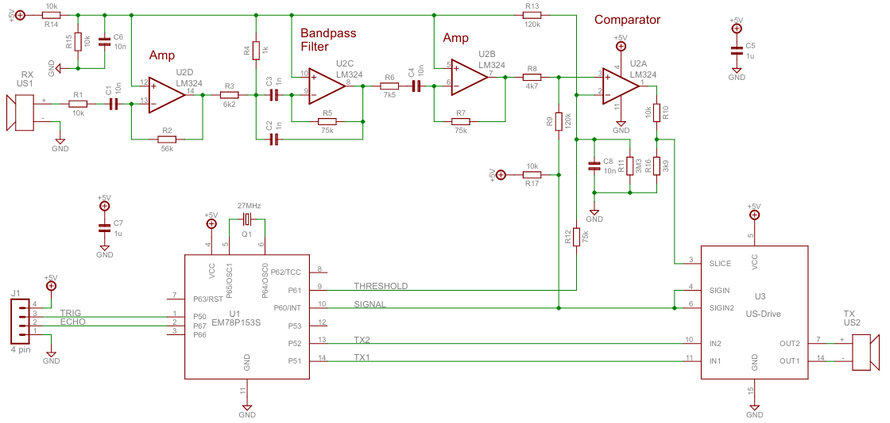
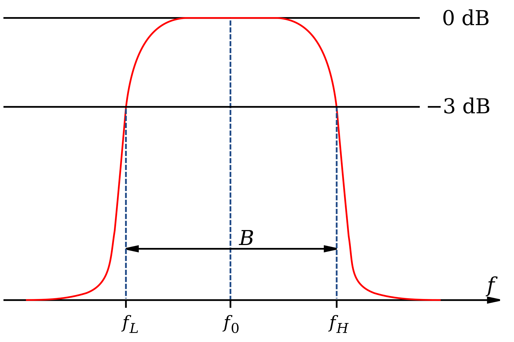
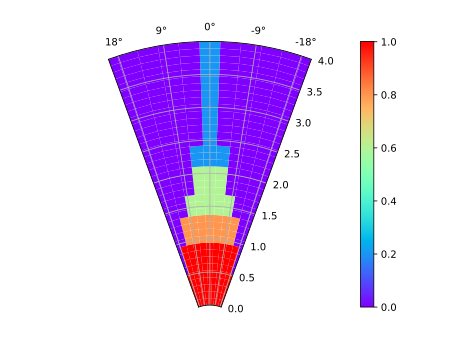
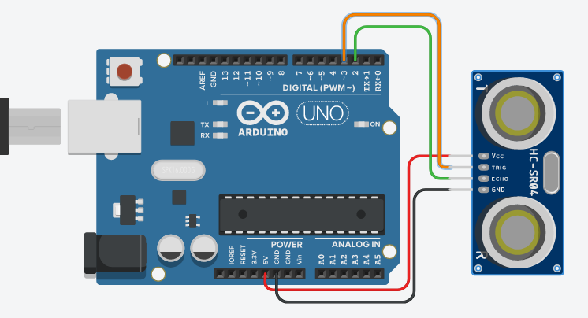

<h1 align="center">VIN Poročilo - 1. DN - 2021/22</h1>

<br><br><br><br><br><br><br><br><br><br><br><br>

<h2 align="center">Ultrazvočna tipala razdalje (HC-SR04)</h2>

<p align="center">
15.03.2022
</p>
<p align="center">
Jan Renar  
</p>

<br><br><br><br>
<br><br><br><br>
<br><br><br><br>
<br><br><br><br>
<br><br><br><br>
<br><br><br><br>

## Grafična skica


<br><br>

## Predstavitev naprave

### Opis in speficikacije
HC-SR04 je preprosta različica ultrazvočnih tipal za merjenje razdalje z uporabo ultrazvočnih valov. Sestavljata ga ultrazvočni oddajnik (zvočnik) in sprejemnik (mikrofon). Ti dve komponenti sta zalotani na sprednjem delu tiskanega vezja, na zadnji strani pa so ostale potrebne komponente za delovanje tega tipala. Tipalo se napaja z 5V enosmernega toka in ima porabo 15mA [1]. V podatkovni listini [1] je specificiran tudi doseg in *vidno polje* tega tipala, merilo naj bi do 4 metre v daljavo in 15° vidno polje v vsako stran, v nadaljevanju bodo predstavljene meritve, ki nakazujejo, da so te vrednosti veljavne le za idealne razmere, katere pa je v realni uporabi skoraj nemogoče doseči [4].

Tipalo razdaljo izmeri tako, da po oddanem ultrazvočnem signalu, meri čas dokler sprejemnik ne zazna odboja in iz izmerjenega časa izračuna prepotovano razdaljo zvočnega valova. Ta princip uporabljajo tudi laserski merilniki razdalje, le da upoštevajo hitrost svetlobe in ne hitrost zvoka, tako kot ultrazvočna tipala. 


<br><br>
<br><br>
<br><br>
<br><br>
<br><br>
<br><br>

### Kaj je ultrazvok in kratka zgodovina

Ultrazvok je definiran kot zvok, ki ima frekvenco višjo od 20kHz, kar je tudi zgornja meja človeškega sluha. Zvok takih frekvenc ima valovno dolžino 1.9cm ali manj [2].

Začetek uporabe ultrazvoka v tehnološke namene sega v leto 1917, ko so uporabili prvo ultrazvočno tipalo za zaznavanje podmornic (imenovano tudi *sonar*). Z nadaljnim razvojem tehnologije, se pojavi uporaba ultrazvoka za namene testiranja materialov in njihovih šibkih točk (npr. varjene kovine) ter uporaba v medicinske namene. Odvisno od namena in materiala, so frekvence ultrazvokov različne. Za ugotavljanje razdalje po zraku, do nekega predmeta je uporabljena frekvenca okoli 40kHz. Za medicinske namene se frekvence gibajo od 1MHz do 18MHz, saj je od frekvence odvisna prodornost zvočnih valov skozi dano tkivo [3].

<br><br>

## Arhitektura, tehnologije in delovanje


*Primer sheme vezja tipala HC-SR04*

### Oddajnik, sprejemnik

### Integrirana vezja

Vsa spodaj opisana integrirana vezja so iz specifičnega tipala HC-SR04 s katerim sem opravljal meritve in se od drugih realizacij tega tipala razlikujejo, vendar služijo istemu namenu.

**LM324**

Integrirano vezje LM324 je sestavljeno iz 4 ločenih operacijskih ojačevalnikov, ki se na ultrazvočnem tipalu uporabljajo kot ojačevalci prejetega signala in kot filter (*Bandpass Filter* na zgornji shemi) za neželjene frekvence, katere sprejemnik zazna poleg oddane frekvence okrog 40kHz. Bandpass filter za razliko od *low pass* filtra in *high pass* filtra, ki filtrirata le nizke ali visoke frekvence, filtrira vse frekvence, ki niso v željenem frekvenčnem razponu. V primeru tipala HC-SR04, so vse frekvence razen tistih v okolici 40kHz, za meritev nepomembne oziroma lahko tudi motnje, zato so odstranjene z *bandpass* filtrom [5].




*Signal bandpass filtra*

**RCWL-9300 in RCWL-9200**

Iz večih spletnih virov je bilo razbrati, da je integrirano vezje RCWL-9300 mikrokrmilnik, namenjen uporabi v napravah za merjenje razdalje. Sprejme vhod *TRIG* in skrbi za pravilen izhod *EHCO* (izhod ECHO je postavljen na visok nivo, dokler sprejemnik čaka na ultrazvočni signal, ki ga je oddal oddajnik), povezan pa je z vezjem RCWL-9200, ki pa je vmesnik med mikrokrmilnikom in ultrazvočnim oddajnikom. Zaradi dejstava, da podatkovne listine za omenjena mikrokrmilnika nisem najdel, komunikacija med njima pa poteka z uporabo splošnega vhodno-izhodnega pina GPIO. Na sliki zadnje strani vezja lahko vidimo oznake M1 in M2, pod njima pa 4 možnosti komunikacije, GPIO (0, 0), IIC (1, 0), 1-wire (1, 1) in UART (0, 1). Konfiguracija se določi z uporoma R2 in R3, katera na tem vezju nista prisotna, to določa GPIO povezavo.


### Meritve dosega

Meritve so izrisane na polarnem koordinatnem sistemu, med -20° in 20°, saj je to bil največji kot na katerem se tipalo še zaznavalo objekte in razdalji do 4 metre. Barva diagrama predstavlja zanesljivost meritve tipala. V rdečem območju do 0.5 metra, je tipalo pravilno izmerilo razdaljo tudi do predmetov, ki so bili izven 15° vidnega polja, ki je omejen v podatkovni listini tipala. Na spodnji shemi lahko vidimo, da kot v kateremu tipalo izvede pravilne merite, po razdalji 1.5 metra, strmo pade pod specificiranih 15°. Vse meritve do 1.5 metra so bile ponovljive, pri višjih razdaljah pa je včasih tipalo vrnilo pravilno vrednost, včasih so bile meritve popolnoma napačne. Podobne ugotovitve oziroma priporočila glede uporabe so bila opisana v spletni literaturi [4].



<br><br>
<br><br>

## Uporaba s kratkim opisom delovanja

Povezava tipala HC-SR04 z Arduino platformo je preprosto, saj potrebuje le 2 signalni povezavi in napajanje. To tipalo deluje z napetostjo napajanja 5V, kar pomeni, da je kompatibilno z veliko različnih sistemov. Omenjeni signalni povezavi pa sta *TRIG*, ki služi kot vhod tipala in *ECHO* kot izhod. V sladu s tem moramo v programski kodi povezane vhode na Arduinu pravilno nastaviti. Spodnja Arduino koda TRIG povezavo za 10 milisekund nastavi na HIGH/5V kar sporoči krmilniku na tipalu, da sproži 8 zvočnih impulzov frekvence približno 40kHz. Po tem pa mikrokrmilnik čaka, dokler se vhod ECHO nastavi na HIGH/5V in ob pozitivni fronti prične meriti čas trajanja visokega stanja na ECHO vhodu. Iz trajanja visokega stanja se z konstanto hitrosti zvoka izračuna izmerjena razdalja.


<br>



```
#define echoPin 3
#define trigPin 2

long duration;
int distance;

void setup() {
  pinMode(trigPin, OUTPUT);
  pinMode(echoPin, INPUT);
  Serial.begin(9600);
}

void loop() {
  digitalWrite(trigPin, LOW);
  delayMicroseconds(2);
  
  // trigPin postavi na HIGH za 10 milisekund in tako sproži meritev na tipalu
  digitalWrite(trigPin, HIGH);
  delayMicroseconds(10);
  digitalWrite(trigPin, LOW);
  
  // pulseIn vrne čas trajanja stanja HIGH, ki ga tipalo nastavi na echoPin povezavo
  duration = pulseIn(echoPin, HIGH);
  
  // Izračun razdalje - 20°C => 343 m/s
  distance = duration * 0.0343 / 2;
  
  Serial.print("Distance: ");
  Serial.print(distance);
  Serial.println(" cm");
  delay(10);
}
```

<br><br>

## Zaključek

Tipalo HC-SR04 je preprosta naprava za merjenje razdalje z uporabo ultrazvočnih valov. Zaradi relativno majhne velikosti, nizke cene in porabe, ter preprostosti uporabe, je to tipalo zelo popularno za amaterske/hobi projekte, kjer je potrebno merjenje razdalje (npr. modeli samovozečih avtomobilov). Slabost tega tipala pa je doseg in zanesljivost meritev na razdaljah daljših od enega metra, zaradi motenj. Za višje razdalje je potrebna uporaba naprednejših tipal, kot so laserski merilniki razdalje.


<br><br>

## Literatura

[1] Ultrasonic Ranging Module HC - SR04 Dostopno na: https://cdn.sparkfun.com/datasheets/Sensors/Proximity/HCSR04.pdf

[2] Ultrasound, Wikipedia. Dostopno na: https://en.wikipedia.org/wiki/Ultrasound

[3] Medical ultrasound, Wikipedia. Dostopno na: https://en.wikipedia.org/wiki/Medical_ultrasound


[4] (2020) How To Detect Objects with HC-SR04 Ultrasonic Sensor, Intorobotics.com. Dostopno na: https://www.intorobotics.com/object-detection-hc-sr04-arduino-millis/


[5] (2018) Circuit Diagram Ultrasonic Distance Sensor HC-SR04. Dostopno na: http://www.pcserviceselectronics.co.uk/arduino/Ultrasonic/HC-SR04-cct.pdf